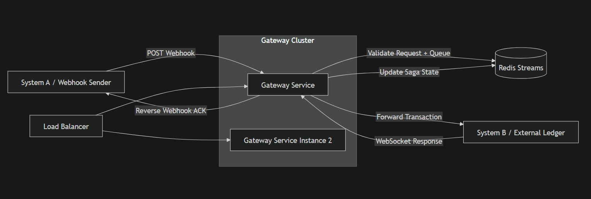

# Architecture diagram

# Saga Gateway Service 
A lightweight HTTP → Redis → WebSocket gateway implementing a distributed Saga pattern between System A (webhooks) and System B (WebSocket ledger).

## Core Responsibilities
- Accept signed webhooks from System A
- Validate ECDSA secp256k1 signatures
- Queue events into Redis Streams
- Forward events to System B over WebSocket
- Handle reconnects, buffering, and retries
- Handle ERR_BUSY with exponential backoff + circuit breaker
- Deliver ACKs back to System A
- Enforce Saga state transitions (RESERVE → COMMIT/COMPENSATE)

## Tech Stack
- Java 17 / Spring Boot
- Redis Streams
- WebSocket client
- Docker Compose
- Node.js load generator

## Endpoints
### POST /api/v1/webhook
Receives events from System A.

### Headers:
X-Timestamp
X-Signature
Content-Type: application/json

### Body:
{
"transactionId": "tx-123",
"eventType": "RESERVE | COMMIT | COMPENSATE"
}

### Returns:
202 Accepted

## Running:
docker compose up --build

## Test webhook (Windows CMD):
- node send.js tx-1 COMPENSATE [Note: this can be used to get timestamp and signature to use in the curl.]
- curl -X POST http://localhost:6001/api/v1/webhook -H "Content-Type: application/json" -H "X-Timestamp: 123" -H "X-Signature: test" -d "{\"transactionId\":\"tx-1\",\"eventType\":\"RESERVE\"}"

## Test using script
- node send.js tx-1 COMPENSATE
- node send.js tx-1 COMMIT
- node send.js tx-1 RESERVE

## Redis Debugging
docker exec -it redis redis-cli XRANGE tx-events-stream - +
docker exec -it redis redis-cli GET tx:state:tx-1

## Testing scripts
1. loadtest.js – Full assessment load test (2k TPS, p99, reconciliation)
2. send.js – Simple manual test script for single transactions
3. ack.js – Mock System A ACK receiver (must run in background)

## Notes/Pending Actions:
1. Full performance test and improvement is yet to be completed.
2. Disable sign verification before loadtest run.